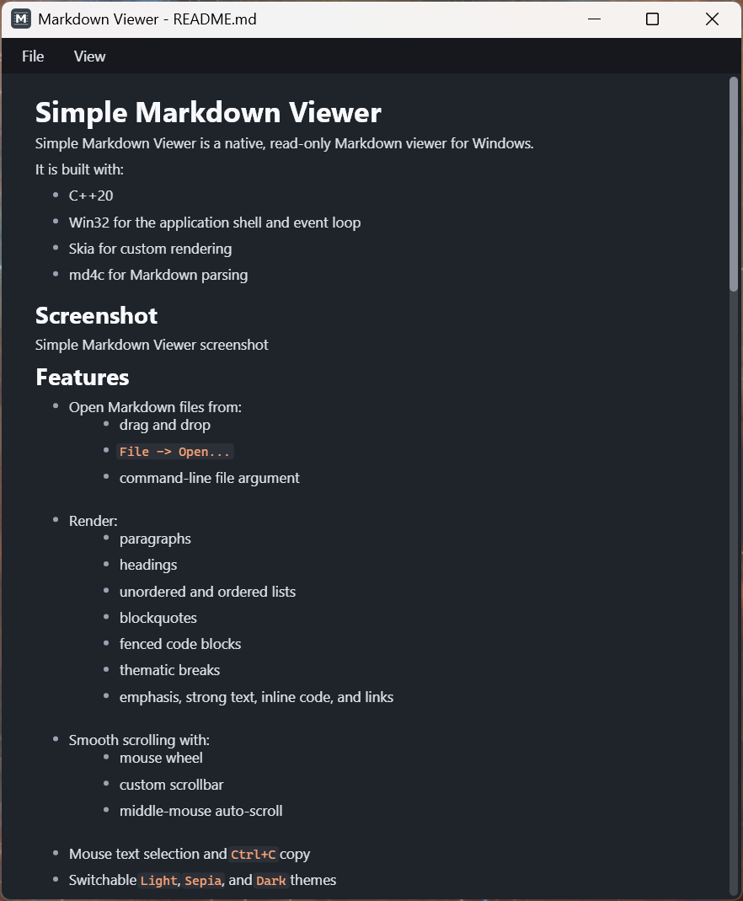

# Simple Markdown Viewer

Simple Markdown Viewer is a native, read-only Markdown viewer with Windows and Linux hosts built on shared viewer logic.

Download the latest ready-to-run Windows build from the repository's `Releases` page.

It is built with:

- C++20
- Win32 or GLFW/GTK for the platform shell and event loop
- Skia for custom rendering
- md4c for Markdown parsing
- Tree-sitter for parser-based code syntax highlighting

## Screenshot



## Download

If you just want to use the app, go to `Releases` and download the latest `mdviewer-windows-x64.zip`.

The release archive contains:

- `mdviewer.exe`
- `LICENSE`
- `THIRD_PARTY_NOTICES`

Extract the zip to a folder of your choice and run `mdviewer.exe`.

## Features

- Open Markdown and plain text files from:
  - drag and drop
  - `File -> Open...`
  - `File` recent files list on Windows
  - command-line file argument
  - clicking internal file links
- Render:
  - paragraphs
  - headings
  - unordered and ordered lists
  - GitHub-style task lists
  - blockquotes
  - fenced code blocks with **one-click copy** and Tree-sitter syntax highlighting
  - thematic breaks
  - tables
  - emphasis, strong text, strikethrough, inline code, and links
  - decoded Markdown entities
  - **Images** with aspect-ratio preservation, fit-to-column scaling, and no forced upscaling beyond intrinsic size
- Navigation:
  - **Full browsing history** (back/forward)
  - Toolbar navigation buttons
  - Mouse side-button support on Windows
- Link Handling:
  - Web links open in your default browser
  - Local Markdown and text files open in the same window
  - Robust detection for extensionless files (like `LICENSE`)
  - **Link hover preview** at the bottom-left
  - `Ctrl+Click` to force any link to open externally
- Smooth scrolling with:
  - mouse wheel
  - custom scrollbar
  - middle-mouse auto-scroll on Windows
- Mouse text selection and `Ctrl+C` copy
- In-document search with `Ctrl+F`, match highlighting, and next/previous navigation
- Search can also be opened from `View -> Find...`
- Native right-click context menu for copying selected text and link actions
- Link text remains selectable while links stay clickable
- Switchable `Light`, `Sepia`, and `Dark` themes
- Custom client-drawn menu bar
- Runtime font selection
- Reader zoom controls with toolbar `+` / `-` and `Ctrl` + `+` / `-`
- Automatic document reload on external file changes while the file is open on Windows
- Persistent settings in `mdviewer.ini` for theme, reading font, zoom level, and recent files
- Embedded Windows app icon

## Scope

Current scope:

- native Windows and Linux hosts
- read-only
- single-window
- custom-rendered

Out of scope:

- Markdown editing
- browser or webview rendering
- multi-document workspace UI
- full rich-text editor behavior

## Architecture Status

The codebase is no longer centered around one large Windows source file.

Current structure:

- `src/app/`: shared application state, config, document loading, link resolution, and controller logic
- `src/render/`: shared themes, typography, document rendering, typeface management, and image caching
- `src/render/syntax/`: Tree-sitter code-block highlighting and language/query mapping
- `src/view/`: shared hit testing and document interaction helpers
- `src/platform/win/`: Win32 host code split into bootstrap, window dispatch, menus, dialogs, clipboard, shell, surface, host orchestration, and input translation
- `src/platform/linux/`: Linux host code built on the same shared controller, rendering, and interaction layers

Important Windows files:

- `win_main.cpp`: process startup and bootstrap
- `win_app.cpp`: owns controller/surface/cache wiring for the Windows host
- `win_window.cpp`: main window message dispatch
- `win_viewer_host.cpp`: document load, relayout, render, theme/font/zoom orchestration
- `win_interaction.cpp`: pointer, keyboard, wheel, drag, and timer behavior
- `win_menu.cpp`: Win32 `HMENU` resources, owner-draw popup menus, recent-file menu rebuilding, and command IDs

Linux host files:

- `linux_main.cpp`: GLFW startup and event loop
- `linux_app.cpp`: app-scoped controller/config wiring
- `linux_viewer_host.cpp`: document load, relayout, render, theme/font/zoom orchestration
- `linux_interaction.cpp`: GLFW input translation into shared interaction/controller actions
- `linux_menu.cpp`: Linux dropdown command models
- `linux_context_menu.cpp`, `linux_file_dialog.cpp`, `linux_font_dialog.cpp`: GTK-backed native helpers
- `linux_clipboard.cpp`, `linux_shell.cpp`, `linux_surface.cpp`: platform services

Recent refactor work moved top-bar layout, drawing, toolbar hit testing, and dropdown drawing into shared rendering code in `src/render/menu_renderer.*`. Platform hosts still own native popup/dropdown command plumbing and event translation. The menu UI typeface is independent from the document font. Windows also has native file watching for live reload.

Code block syntax highlighting is implemented in the shared layout/rendering path. Fenced code block languages currently supported by Tree-sitter are `c`, `cpp`, `javascript`, `typescript`, `tsx`, `json`, `python`, `bash`/`sh`, `rust`, `go`, and `csharp`; unknown languages fall back to plain code rendering.

Windows has release packaging today. Linux is implemented in-tree and builds from the same CMake project on Linux.

## Windows Build Requirements

- Windows
- Visual Studio 2022 with C++ build tools
- Python
- Git
- Network access for the first dependency fetch, unless `build/_deps` is already populated

The PowerShell build script imports the Visual Studio environment automatically with `vswhere` and `vcvars64.bat`.

## Building On Windows

First build, including dependency setup:

```powershell
.\build.ps1 -Configuration Release
```

Subsequent local builds when Skia is already available:

```powershell
.\build.ps1 -SkipSkia -Configuration Release
```

Useful variants:

```powershell
.\build.ps1 -Clean -SkipSkia -Configuration Release
.\build.ps1 -Configuration Debug
.\build.ps1 -RunSmokeTest
```

## GitHub Builds And Releases

- GitHub Actions builds the Windows release on pushes to `main` and on pull requests.
- CI prefers a prebuilt Windows Skia bundle so normal app builds do not rebuild Skia from source.
- Each workflow run uploads `mdviewer-windows-x64.zip` as a build artifact.
- Pushing a tag like `v0.1.4` also creates or updates a GitHub release and attaches the packaged Windows build.
- Release archives contain `mdviewer.exe`, `LICENSE`, and `THIRD_PARTY_NOTICES`.

Default output:

```text
build/Release/mdviewer.exe
```

## Running

Launch the viewer:

```powershell
.\build\Release\mdviewer.exe
```

Open a file immediately:

```powershell
.\build\Release\mdviewer.exe .\README.md
```

The app stores `mdviewer.ini` next to the executable and uses it for theme, font, zoom, and recent-file persistence.

## Linux Build Notes

The Linux host is compiled from the same CMake target on Linux. It uses GLFW for the window/event loop and GTK3 for native dialogs/context menus, alongside the same Skia, md4c, and Tree-sitter dependencies.

## Controls

- `File -> Open...`: open a file
- `File`: reopen recently opened files on Windows
- drag and drop: open a file
- mouse wheel: scroll
- middle mouse button: auto-scroll mode on Windows
- left mouse drag: select text
- `Ctrl+C`: copy selected text
- `Ctrl+F`: search within the current document
- `Enter` / `Shift+Enter`: move to the next or previous search match while search is open
- `Escape`: close search
- Search close button: click the `x` button in the search box
- right click: open a native context menu with selection/link actions
- external file save: reload the currently open document automatically on Windows
- `View -> Select Font...`: choose the reading font
- `View -> Theme`: switch between light, sepia, and dark themes
- `Ctrl` + `+` / `-`: zoom document text in and out
- **Navigation**:
  - `Alt + Left` or `Backspace`: Go Back
  - `Alt + Right`: Go Forward
  - `Left / Right Arrow`: Go Back/Forward (if no text is selected)
  - Mouse side buttons: Go Back/Forward on Windows
  - Toolbar buttons: Click the arrows in the top-right corner
- **Zoom**:
  - Toolbar buttons: Click `+` or `-` in the top-right corner
- **Links**:
  - `Click`: Open internally (MD/Text) or externally (Web/Other)
  - `Ctrl + Click`: Force open in default system application
  - `Right Click`: open/copy link from the native context menu
  - `Hover`: Preview target path in bottom-left overlay
  - `Click and drag`: select link text without opening the link
- **Code Blocks**:
  - Click the **icon in the top-right corner** of a code block to copy its entire content

## Dependencies

Direct dependencies used by the current build:

- `Skia`
  - role: 2D rendering and text drawing
  - license: BSD-3-Clause-style
  - local license file: `third_party/skia/LICENSE`
- `md4c`
  - role: Markdown parsing
  - version: `release-0.5.2`
  - license: MIT
  - local license file: `build/_deps/md4c-src/LICENSE.md`
- `Tree-sitter`
  - role: parser-based syntax highlighting for fenced code blocks
  - license: MIT
  - local license file: `build/_deps/tree_sitter-src/LICENSE`
- Tree-sitter grammars for `c`, `cpp`, `javascript`, `typescript`/`tsx`, `json`, `python`, `bash`, `rust`, `go`, and `c-sharp`
  - role: language parsers and highlight queries
  - license: MIT
  - local license files: `build/_deps/tree_sitter_*-src/LICENSE`
- `GLFW`
  - role: Linux native window/event integration
  - version: `3.3.8`
  - license: Zlib
- `GTK3`
  - role: Linux native file, font, and context menu helpers
  - license: LGPL-family GTK license

Windows system libraries linked by the app:

- `windowscodecs`
- `dwrite`
- `usp10`
- `ole32`
- `user32`
- `gdi32`
- `shell32`

Linux system libraries linked by the app include:

- `fontconfig`
- `freetype`
- `pthread`
- `dl`
- `GL`
- `X11`

## Licensing

This project is licensed under the MIT License. See [LICENSE](LICENSE).

Third-party dependency notices are included in [THIRD_PARTY_NOTICES](THIRD_PARTY_NOTICES).

## Repository Layout

```text
src/
  app/            Shared app state, config, controller, loading, links
  layout/         Document layout and text flow
  markdown/       Markdown parsing into the internal model
  render/         Shared themes, typography, renderer, typefaces, image cache
  render/syntax/  Tree-sitter code-block syntax highlighting
  view/           Shared hit testing and interaction logic
  platform/linux/ Linux host integration
  platform/win/   Win32 bootstrap, window dispatch, menus, input, and host code
  util/           File I/O and font helpers

resources/
  app.rc
  app_icon.ico

assets/
  screenshot.png

build.ps1         Windows build script
CMakeLists.txt    CMake project definition
```

## Notes

- The viewer copies rendered text content, not raw Markdown markup.
- Search matches rendered document text, not raw Markdown source.
- Syntax highlighting uses Tree-sitter for fenced code blocks with known language tags; unknown languages render as plain code.
- The app has native Windows and Linux hosts sharing the same document/controller/render/view layers.
- The menu bar is client-drawn so it can follow the selected theme; shared layout/drawing helpers live in `src/render/menu_renderer.*`.
- The document zoom affects rendered document typography, not the top menu bar.
- On Windows, live reload is event-driven via OS file-change notifications rather than polling.
- Recent refactor work moved config, controller, rendering support, interaction logic, and most host orchestration out of the old monolithic Windows entry file.
