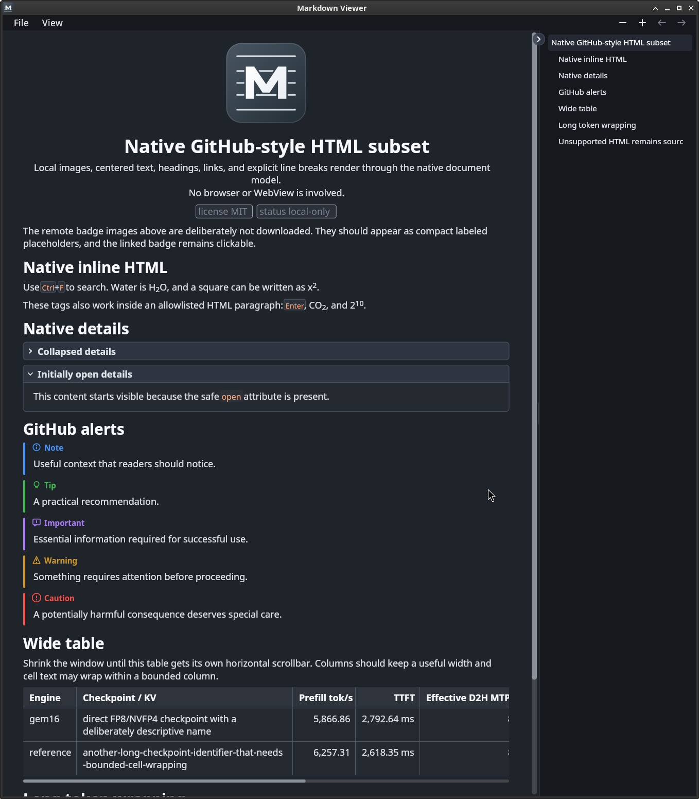

# Simple Markdown Viewer

Simple Markdown Viewer is a native, read-only Markdown viewer with Windows and Linux hosts built on shared viewer logic.

Download the latest ready-to-run Windows or Linux build from the repository's `Releases` page.

It is built with:

- C++20
- Win32 or GLFW/GTK for the platform shell and event loop
- Skia for custom rendering
- md4c for Markdown parsing
- HarfBuzz and ICU through Skia for native complex-text shaping, Unicode BiDi,
  grapheme-aware wrapping, and font fallback
- utf8proc for portable Unicode heading anchors
- Tree-sitter for parser-based code syntax highlighting
- MicroTeX for native LaTeX math layout

## Screenshot



## Download

Ready-to-run archives are published on the repository's `Releases` page:

- **Windows x64:** download `mdviewer-windows-x64.zip`, extract it, and run `mdviewer.exe`.
- **Linux x86-64:** download `mdviewer-linux-x64.tar.gz`, extract it, and run `mdviewer-linux-x64/run-mdviewer.sh`.

Both archives include the application, `LICENSE`, `THIRD_PARTY_NOTICES`, and this README. The Linux archive also includes desktop-entry and icon metadata under `share/`; it relies on normal distribution-provided GTK3, OpenGL, X11, fontconfig, freetype, and C/C++ runtime libraries.

## Features

- Open Markdown and plain text files from:
  - drag and drop
  - `File -> Open...`
  - `File` recent files list on Windows and Linux
  - command-line file argument
  - clicking internal file links
- Save the currently open Markdown document as PDF from `File -> Save as PDF...`
- Print the currently open Markdown document with the native system print dialog on Windows and Linux from `File -> Print...`
- Render:
  - paragraphs
  - headings
  - unordered and ordered lists
  - GitHub-style task lists
  - blockquotes
  - fenced code blocks with **one-click copy**, Tree-sitter syntax highlighting, and per-block horizontal scrolling for long source lines
  - thematic breaks
  - tables with horizontal scrolling when their useful column widths exceed the viewport
  - combinable emphasis, strong text, strikethrough, inline code, and links
  - CommonMark soft breaks as flowing whitespace and explicit hard breaks as visible line breaks
  - a browser-free HTML allowlist for GitHub-style centered paragraphs/headings, links, local images, `<br>`, keyboard keys, subscript/superscript, and native collapsible details; unsupported or unsafe HTML remains visible as source
  - GitHub-style note, tip, important, warning, and caution alerts with native colors and icons
  - native, browser-free LaTeX mathematics in conservatively recognized `$...$` and explicit `$$...$$`, including fractions, roots, scripts, large operators, matrices, accents, scalable delimiters, selection/search/copy source preservation, and a visible source fallback; ordinary prices, shell variables, unmatched dollar signs, and dollar-wrapped prose remain text
  - decoded Markdown entities
  - Arabic, Hebrew, mixed-direction, and other complex-script text through
    native HarfBuzz shaping and the Unicode Bidirectional Algorithm, including
    direction-aware wrapping, selection, search highlighting, links, lists,
    tables, details, code, print/PDF output, and heading-outline labels
  - **Local raster and SVG images** with aspect-ratio preservation, fit-to-column scaling, requested HTML dimensions, and no forced upscaling beyond intrinsic size; SVGs may derive their intrinsic size from `width`/`height` or `viewBox`, while SVG HTML `<foreignObject>` content is not supported
- Navigation:
  - **Full browsing history** (back/forward) with per-document reading-position restoration
  - Generated nested heading outline that highlights the current section and can be collapsed, placed on either side, resized, scrolled independently, and navigated by keyboard
  - GitHub-compatible Unicode heading anchors with deterministic suffixes for duplicate headings
  - Toolbar navigation buttons
  - Mouse side-button support on Windows
- Link Handling:
  - Web links open in your default browser
  - Local Markdown and text files open in the same window
  - Robust detection for extensionless files (like `LICENSE`)
  - Clear feedback for missing local files and heading fragments
  - Confirmation before opening executable local files
  - Rejection of suspicious or unsupported schemes instead of passing them to the operating system
  - **Link hover preview** at the bottom-left
  - `Ctrl+Click` to force any link to open externally
- Smooth scrolling with:
  - mouse wheel
  - custom scrollbar
  - browser-style middle-mouse auto-scroll on Windows and Linux
- Responsive document margins and live relayout while resizing the window or outline; cached image dimensions avoid repeated image scaling during a resize
- Safe UTF-8 boundary wrapping for very long unbroken strings and URLs
- Remote images are not fetched inside the app; HTML badges and other remote images use labeled placeholders and can still be opened explicitly
- Mouse text selection and `Ctrl+C` copy
- In-document search with `Ctrl+F`, match highlighting, and next/previous navigation
- Search can also be opened from `View -> Find...`
- Native right-click context menu for selection/link actions, reload, document-path copying, and opening files in the file manager
- Image context actions for opening local or remote images, copying image paths, and opening local images in the file manager
- Table context actions for copying tabular data as TSV or correctly quoted CSV
- YAML, TOML, and conservatively recognized JSON front matter rendered as a compact bar for title, author, date, and tags; other raw fields stay hidden
- Markdown file recognition for `.md`, `.markdown`, `.mdown`, and `.mkd`
- Link text remains selectable while links stay clickable
- Switchable `Light`, `Sepia`, and `Dark` themes
- Custom client-drawn menu bar
- Runtime font selection
- Reader zoom controls with toolbar `+` / `-` and `Ctrl` + `+` / `-`
- Manual document reload with `F5`, plus automatic reload on external file changes while the file is open on Windows
- Persistent per-user settings in `mdviewer.ini` for theme, reading font, zoom level, outline side/width, recent files with opened timestamps and scroll positions, and window placement on Windows and Linux
- Platform app icons for the Windows executable and Linux window/desktop integration

## Product Scope

- native Windows and Linux hosts
- read-only
- single-window
- custom-rendered

Out of scope:

- Markdown editing
- browser or webview rendering
- multi-document workspace UI
- full rich-text editor behavior

## How It Works

The viewer parses Markdown into a shared document model, computes native layout, and draws the document and themed menu bar with Skia. It does not embed a browser or WebView. HarfBuzz and ICU provide cached glyph shaping, Unicode BiDi, line/grapheme breaking, and font fallback for the document surface. Windows and Linux share document loading, parsing, layout, rendering, themes, typography, image handling, syntax highlighting, selection, search, history, link policy, configuration, and most interaction behavior.

The Win32 and GLFW/GTK hosts translate native events and provide platform services such as windows, dialogs, printing, clipboard access, shell integration, drag and drop, timers, and surface presentation. Tree-sitter highlighting supports `c`, `cpp`, `javascript`, `typescript`, `tsx`, `json`, `python`, `bash`/`sh`, `rust`, `go`, and `csharp`; unknown language tags render as plain code.

Windows and Linux archives are built from the same CMake project and published together for version tags.

## Building from Source

### Windows Requirements

- Windows
- Visual Studio 2022 with C++ build tools
- Python
- Git
- Network access for the first dependency fetch, unless `build/_deps` is already populated

The PowerShell build script imports the Visual Studio environment automatically with `vswhere` and `vcvars64.bat`.

### Build on Windows

First build, including dependency setup:

```powershell
.\build.ps1 -Configuration Release
```

Subsequent local builds when Skia is already available:

```powershell
.\build.ps1 -SkipSkia -Configuration Release
```

Useful variants:

```powershell
.\build.ps1 -Clean -SkipSkia -Configuration Release
.\build.ps1 -Configuration Debug
.\build.ps1 -RunSmokeTest
```

### Build on Linux

The Linux host uses GLFW for the window and event loop plus GTK3 for native dialogs, printing, and context menus. Build the PDF-enabled application and run the tests with:

```bash
./build.sh
cmake --build build --target mdviewer_tests --parallel 2
ctest --test-dir build --output-on-failure
```

Use `./build.sh --skip-skia` after Skia has already been built. Use `./build.sh --disable-pdf` only with a Skia build that does not include its PDF backend.

Create a stripped Linux archive with `./package-linux.sh`, or `./package-linux.sh --skip-build` after a Release build. The archive and checksum are written to `dist/mdviewer-linux-x64.tar.gz` and `dist/mdviewer-linux-x64.tar.gz.sha256`. See [`docs/LINUX_SMOKE_TEST.md`](docs/LINUX_SMOKE_TEST.md) for release validation.

### Run local builds

Windows:

```powershell
.\build\Release\mdviewer.exe
.\build\Release\mdviewer.exe .\README.md
```

Linux:

```bash
./build/mdviewer
./build/mdviewer README.md
```

## Configuration

The app stores `mdviewer.ini` in the per-user config directory. It persists the selected theme and font, zoom, outline side and width, recent files with timestamps and reading positions, and window placement:

- Windows: `%APPDATA%\Simple Markdown Viewer\mdviewer.ini`
- Linux: `$XDG_CONFIG_HOME/simple-markdown-viewer/mdviewer.ini`, or `~/.config/simple-markdown-viewer/mdviewer.ini`

If no per-user configuration exists, the app can import a legacy `mdviewer.ini` next to the executable. All subsequent saves use the per-user path.

## GitHub Builds and Releases

GitHub Actions builds Windows and Linux for version tags matching `v*` and for manual workflow runs. The Windows workflow consumes the pinned prebuilt Skia bundle documented in [`docs/WINDOWS_SKIA_BUNDLE.md`](docs/WINDOWS_SKIA_BUNDLE.md); Linux performs normal and sanitizer test passes. A tag such as `v0.3.1` publishes `mdviewer-windows-x64.zip`, `mdviewer-linux-x64.tar.gz`, and the Linux SHA-256 checksum.

The complex-text stack requires a Windows Skia bundle containing SkShaper,
SkUnicode, HarfBuzz, ICU, and `icudtl.dat`. Build and validate that replacement
bundle on Windows before publishing a release containing complex-text support.

## Controls

- `File -> Open...`: open a file
- `File -> Reload` or `F5`: reload the current document and preserve its reading position when practical
- `File -> Save as PDF...`: export the currently open Markdown document to PDF
- `File -> Print...` or `Ctrl+P`: print the currently open Markdown document on Windows or Linux
- `File`: reopen recently opened files on Windows or Linux; the newest file appears first with its last-opened date and time
- drag and drop: open a file
- mouse wheel: scroll
- `Ctrl` + mouse wheel: zoom document text in and out
- Code blocks: drag the horizontal scrollbar, use a horizontal touchpad gesture, or hold `Shift` while using the mouse wheel
- middle mouse button: toggle browser-style auto-scroll mode on Windows or Linux; move above or below the origin to control direction and speed, then stop with middle-click, left-click, wheel, or `Escape`
- left mouse drag: select text
- `Ctrl+C`: copy selected text
- `Ctrl+F`: search within the current document
- `Enter` / `Shift+Enter`: move to the next or previous search match while search is open
- `Escape`: close search
- Search close button: click the `x` button in the search box
- `F10`, `Alt+F`, `Alt+V`, or `Alt+T`: open the application menus; navigate with arrows, `Enter`, and `Escape`, or use number keys for recent files
- right click: open a native context menu with selection, link, image, table, reload, document-path, and file-manager actions
- external file save: reload the currently open document automatically on Windows
- `View -> Select Font...`: choose the reading font
- `View -> Theme`: switch between light, sepia, and dark themes
- `View -> Show Outline`: show or collapse the heading outline with `Ctrl+Shift+O`
- `View -> Outline on Left/Right`: choose the outline side; saved as `outline_side=left` or `outline_side=right`
- Outline sidebar: use the mouse wheel or scrollbar for long heading lists; drag the divider to resize it. The width is saved as `outline_width`.
- `Ctrl` + `+` / `-`: zoom document text in and out
- **Navigation**:
  - `Alt + Left` or `Backspace`: Go Back
  - `Alt + Right`: Go Forward
  - `Left / Right Arrow`: Go Back/Forward (if no text is selected)
  - Mouse side buttons: Go Back/Forward on Windows
  - Toolbar buttons: Click the arrows in the top-right corner
- **Zoom**:
  - Toolbar buttons: Click `+` or `-` in the top-right corner
- **Links**:
  - `Click`: Open internally (MD/Text) or externally (Web/Other)
  - `Ctrl + Click`: Force open in default system application
  - `Right Click`: open/copy links and open local targets in the file manager from the native context menu
  - Executable local files require confirmation before opening
  - `Hover`: Preview target path in bottom-left overlay
  - `Click and drag`: select link text without opening the link
- **Code Blocks**:
  - Click the **icon in the top-right corner** of a code block to copy its entire content

## Dependencies

Direct dependencies:

- `Skia`
  - role: 2D rendering, text drawing, and PDF generation
  - license: BSD-3-Clause-style
  - local license file: `third_party/skia/LICENSE`
- `md4c`
  - role: Markdown parsing
  - version: `release-0.5.2`
  - license: MIT
  - local license file: `build/_deps/md4c-src/LICENSE.md`
- `utf8proc`
  - role: portable Unicode case conversion for heading anchors
  - version: `v2.11.3`
  - license: MIT, including Unicode data under the bundled Unicode data license
  - local license file: `build/_deps/utf8proc-src/LICENSE.md`
- `MicroTeX`
  - role: native TeX math layout rendered through Skia
  - version: commit `0e3707f6dafebb121d98b53c64364d16fefe481d`
  - license: MIT; bundled math-font licenses are copied with the runtime resources
  - local license file: `build/_deps/microtex-src/LICENSE`
- `tinyxml2`
  - role: loading MicroTeX's bundled font metadata
  - version: `9.0.0`
  - license: Zlib
  - local license file: `build/_deps/tinyxml2-src/LICENSE.txt`
- `Tree-sitter`
  - role: parser-based syntax highlighting for fenced code blocks
  - license: MIT
  - local license file: `build/_deps/tree_sitter-src/LICENSE`
- Tree-sitter grammars for `c`, `cpp`, `javascript`, `typescript`/`tsx`, `json`, `python`, `bash`, `rust`, `go`, and `c-sharp`
  - role: language parsers and highlight queries
  - license: MIT
  - local license files: `build/_deps/tree_sitter_*-src/LICENSE`
- `GLFW`
  - role: Linux native window/event integration
  - version: `3.3.8`
  - license: Zlib
- `GTK3`
  - role: Linux native file, font, and context menu helpers
  - license: LGPL-family GTK license

Windows system libraries linked by the app:

- `windowscodecs`
- `dwrite`
- `usp10`
- `ole32`
- `user32`
- `gdi32`
- `shell32`

Linux system libraries linked by the app include:

- `fontconfig`
- `freetype`
- `pthread`
- `dl`
- `GL`
- `X11`

## Licensing

This project is licensed under the MIT License. See [LICENSE](LICENSE).

Third-party dependency notices are included in [THIRD_PARTY_NOTICES](THIRD_PARTY_NOTICES).

## Repository Layout

```text
src/
  app/            Shared app state, config, controller, loading, links
  layout/         Document layout and text flow
  markdown/       Markdown parsing into the internal model
  render/         Shared themes, typography, renderer, typefaces, image cache
  render/syntax/  Tree-sitter code-block syntax highlighting
  view/           Shared hit testing and interaction logic
  platform/linux/ Linux host integration
  platform/win/   Win32 bootstrap, window dispatch, menus, input, and host code
  util/           File I/O and font helpers

resources/
  app.rc
  app_icon.ico
  linux/mdviewer.png

app_icon.svg      Canonical vector application logo
app_icon.png      High-resolution PNG rendered from the SVG

assets/
  screenshot.png

build.ps1         Windows build script
CMakeLists.txt    CMake project definition
```

## Notes

- The viewer copies rendered text content, not raw Markdown markup.
- Search matches rendered document text, not raw Markdown source.
- Syntax highlighting uses Tree-sitter for fenced code blocks with known language tags; unknown languages render as plain code.
- Markdown source is passed to md4c unchanged; fenced and indented code is never rewritten by a normalization pass.
- The app has native Windows and Linux hosts sharing the same document/controller/render/view layers.
- The menu bar is client-drawn so it can follow the selected theme; shared layout/drawing helpers live in `src/render/menu_renderer.*`.
- The document zoom affects rendered document typography, not the top menu bar.
- PDF export uses Skia's PDF backend and the shared document renderer with PDF-specific page margins and page-break handling. Export typography is tuned to visually approximate the interactive viewer at 100%. Wide tables and code blocks are reduced locally within a readability limit, then clipped if they still exceed the page; interactive scrollbars are never rendered into output.
- Windows and Linux printing use native system print dialogs and the same shared paginated renderer as PDF export; the app does not provide an in-app print preview.
- On Windows, live reload is event-driven via OS file-change notifications rather than polling.
